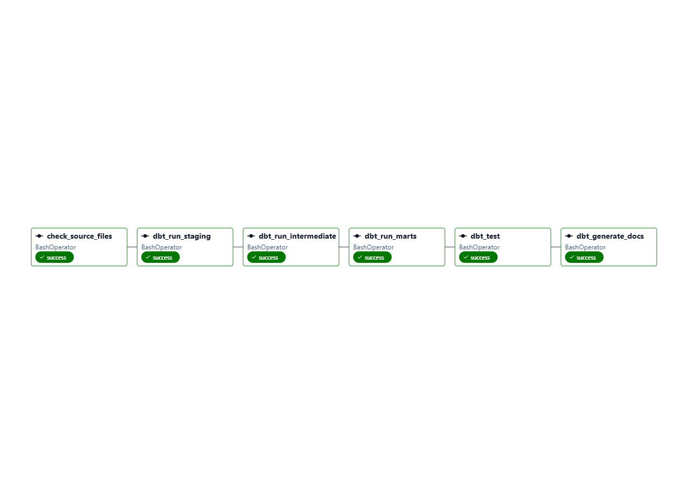

# Modern Data Warehouse — Medallion Architecture + dbt + Metabase

[](https://www.getdbt.com/)
[](https://www.microsoft.com/sql-server)
[](https://www.metabase.com/)
[](LICENSE)

A production-grade data warehouse built on SQL Server using the Medallion Architecture (Bronze → Silver → Gold), with dbt for transformations and lineage, and Metabase for business analytics.

**Scale:** 10 source files · 15 tables · 195,469 records · ERP + CRM

---

## 📊 System Architecture

```
┌────────────────────────────────────────────────────────────────┐
│                        DATA SOURCES                             │
├──────────────────────┬─────────────────────────────────────────┤
│   ERP System (CSV)   │      CRM System (CSV)                    │
│  • Customers         │   • Customer Info                        │
│  • Locations         │   • Sales Details                        │
│  • Products          │   • Product Info                         │
└──────────┬───────────┴──────────────┬──────────────────────────┘
           │                          │
           └──────────────┬───────────┘
                          ▼
     ┌────────────────────────────────────────┐
     │  🥉 BRONZE — Raw Ingestion             │
     │  ✓ 10 CSV files loaded as-is           │
     │  ✓ No transformations applied          │
     │  ✓ Full audit trail preserved          │
     └────────────────┬───────────────────────┘
                      ▼
     ┌────────────────────────────────────────┐
     │  🥈 SILVER — Cleansed & Standardized   │
     │  ✓ Whitespace trimmed                  │
     │  ✓ Type casting (date, numeric)        │
     │  ✓ Deduplication applied               │
     │  ✓ Data quality flags added            │
     └────────────────┬───────────────────────┘
                      ▼
     ┌────────────────────────────────────────┐
     │  🥇 GOLD — Star Schema                 │
     │  ✓ dim_customers (Dimension)           │
     │  ✓ fct_sales (Fact)                    │
     │  ✓ mart_product_performance (Aggregate)│
     └────────────────┬───────────────────────┘
                      ▼
     ┌────────────────────────────────────────┐
     │  🔄 DBT — Transformations & Lineage    │
     │  ✓ 7 models (staging/intermediate)     │
     │  ✓ 4 data quality tests                │
     │  ✓ Automated lineage graph             │
     └────────────────┬───────────────────────┘
                      ▼
     ┌────────────────────────────────────────┐
     │  🔄 Airflow — Automated Orchestration  │
     │  ✓ 6 Automated Pipelines               │
     │  ✓ Runs daily at 6 AM                  │
     │  ✓ Automated airflow_dag.png            │
     └────────────────┬───────────────────────┘
                      ▼
     ┌────────────────────────────────────────┐
     │  📊 METABASE — BI Dashboards           │
     │  ✓ Revenue trends                      │
     │  ✓ Customer segments                   │
     │  ✓ Product performance                 │
     └────────────────────────────────────────┘
```

---

## 🎯 Key Features

- **End-to-end data pipeline** for ERP and CRM system ingestion
- **Medallion Architecture** with clear separation of concerns (Bronze/Silver/Gold)
- **Data quality checks** and automated cleansing
- **dbt-powered transformations** with lineage tracking and testing
- **Star schema design** for optimized analytical queries
- **Metabase dashboards** for business intelligence and insights
- **Production-ready** documentation and schema governance

---

## 📋 Quick Start

### Prerequisites
- SQL Server 2022
- Python 3.10+
- Docker (for Metabase)

### Steps

#### 1️⃣ Load Bronze & Silver Layers (SQL)
```sql
EXEC bronze.load_bronze;
EXEC silver.load_silver;
```

#### 2️⃣ Run dbt Transformations
```bash
cd dbt_warehouse
pip install dbt-sqlserver
dbt debug
dbt run
dbt test
dbt docs serve --port 8081
```

#### 3️⃣ Start Airflow
cd airflow
docker-compose up -d
# Open http://localhost:8083


#### 4 Launch Metabase Dashboard
```bash
docker run -d -p 3000:3000 --name metabase metabase/metabase
# Open http://localhost:3000
```

---

## 🏗️ Medallion Layers

### 🥉 Bronze — Raw Ingestion
**Purpose:** Land all source data as-is without transformation

| Aspect | Details |
|--------|---------|
| **Files** | 10 source CSV files |
| **Transformations** | None — raw data preservation |
| **Audit Trail** | Full timestamp tracking |
| **Key Tables** | `crm_cust_info`, `crm_sales_details`, `crm_prd_info`, `erp_cust_az12`, `erp_loc_a101`, `erp_px_cat_g1v2` |

### 🥈 Silver — Cleansed & Standardized
**Purpose:** Prepare data for analytics with quality checks

| Transformation | Description |
|---|---|
| **Whitespace Trimming** | Remove leading/trailing spaces |
| **Type Casting** | Convert date integers (20101229) → DATE |
| **Normalization** | Standardize gender/marital status values |
| **Deduplication** | Remove duplicates using ROW_NUMBER() |
| **Data Flags** | Add quality flags for data lineage |

### 🥇 Gold — Star Schema
**Purpose:** Optimized dimensional model for analytics

| Object | Type | Description |
|--------|------|-------------|
| `dim_customers` | Dimension | Customer master + RFM segments |
| `fct_sales` | Fact | Order-level transactions with metrics |
| `mart_product_performance` | Aggregate | Revenue ranking by product category |

---

## 🔄 dbt Models & Lineage

```
models/
├── staging/                    (Bronze → cleansed views)
│   ├── stg_crm_customers.sql
│   ├── stg_crm_sales.sql
│   └── stg_crm_products.sql
├── intermediate/               (business logic assembly)
│   └── int_customer_orders.sql
└── marts/                      (analytics-ready tables)
    ├── dim_customers.sql
    ├── fct_sales.sql
    └── mart_product_performance.sql
```

**Test Results:**
- `dbt run` → ✅ PASS=7 ERROR=0
- `dbt test` → ✅ PASS=3 ERROR=0

### 📈 View Lineage Graph
```bash
dbt docs serve --port 8081
```


---

### Airflow Pipeline (Orchestration)

6-task automated pipeline runs daily at 6 AM:
check_sources → dbt_staging → dbt_intermediate → dbt_marts → dbt_test → dbt_docs



## 📊 Metabase Dashboards

### Available Views
- **Revenue Analytics** — Sales trends and forecasting
- **Customer Segments** — RFM-based customer classification
- **Product Performance** — Top/bottom performers by category


---

## 🛠️ Tech Stack

| Component | Technology | Purpose |
|-----------|-----------|---------|
| **Database** | SQL Server 2022 | Data warehouse engine |
| **Transformation** | T-SQL + dbt Core 1.11 | ETL logic & lineage |
| **Architecture** | Medallion (Bronze/Silver/Gold) | Layer separation |
| **Schema Design** | Star Schema | Dimensional modeling |
| **BI Tool** | Metabase | Analytics dashboards |
| **Orchestration** | Python scripts | Automation framework |

---

## 📁 Project Structure

```
sql-data-warehouse-project/
├── datasets/                # Source CSV files
│   ├── erp_*.csv
│   └── crm_*.csv
├── scripts/                 # SQL transformation scripts
│   ├── 01_bronze.sql
│   ├── 02_silver.sql
│   └── 03_gold.sql
├── dbt_warehouse/           # dbt project root
│   ├── models/
│   │   ├── staging/         # Staging transformations
│   │   ├── intermediate/    # Business logic layer
│   │   └── marts/           # Analytics-ready marts
│   ├── tests/               # dbt test definitions
│   ├── dbt_project.yml
│   └── profiles.yml
├── docs/
│   ├── images/
│   │   ├── dbt_lineage.png
│   │   └── metabase_dashboard.png
│   └── architecture.md
└── README.md
```

---

## 📚 Use Cases & Queries

### Customer Segmentation
```sql
SELECT segment, COUNT(*) customer_count
FROM dim_customers
GROUP BY segment;
```

### Product Performance
```sql
SELECT product_name, SUM(sales_amount) revenue
FROM fct_sales
GROUP BY product_name
ORDER BY revenue DESC;
```

### Sales Trends
```sql
SELECT DATE_TRUNC(order_date, MONTH) month, SUM(sales_amount) revenue
FROM fct_sales
GROUP BY month
ORDER BY month;
```

---

## 🚀 Next Steps

- [ ] Add incremental dbt models for production scaling
- [ ] Implement data governance and metadata catalog
- [ ] Configure automated daily refresh pipeline
- [ ] Add advanced Metabase drill-down dashboards
- [ ] Document business logic in dbt YAML models

---

## 📖 Documentation

- **Architecture Details** — See [docs/architecture.md](docs/architecture.md)
- **dbt Documentation** — Run `dbt docs serve --port 8081` after dbt run
- **Planning & Wireframes** — Maintained in Notion and Draw.io
- **ERD Diagrams** — [Link to visualization tool]

---

## 📝 License

This project is licensed under the MIT License — see [LICENSE](LICENSE) for details.

---

## 👤 Author

Created as a production-grade data warehouse reference implementation.

**Last Updated:** May 2026
